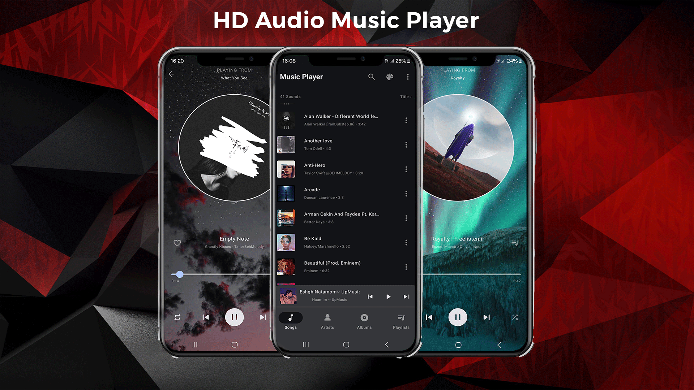
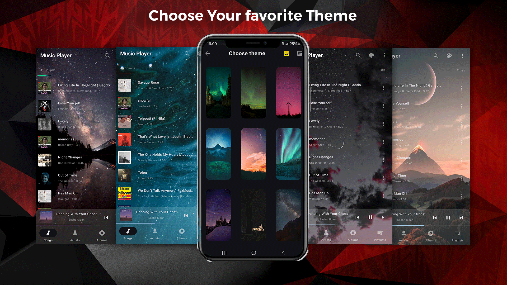
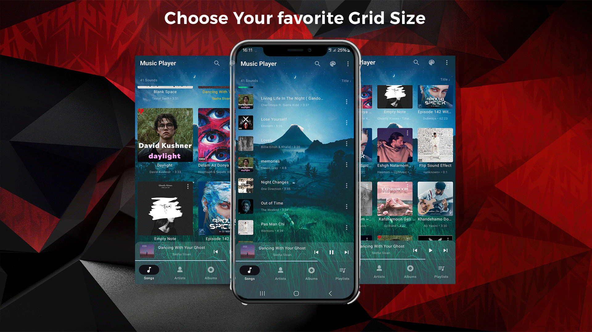

# Music Player 

🎉 Elevate Your Music Experience 🎶

Step into a music player that's not just about listening but about creating your perfect vibe. Our sleek, modern design lets you personalize your player with stunning backgrounds, whether it's a picture or a gradient, and choose different grid sizes and image styles. With dedicated sections for albums, artists, songs, and playlists, finding the music you love has never been easier. Simple, intuitive controls ensure smooth sound playback without the complexity of unnecessary features. This app is all about enjoying your music, your way.

## ScreenShots 

  

  

  

  

  

  

